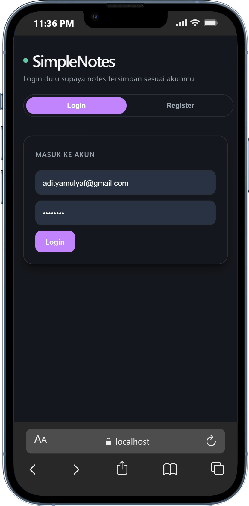
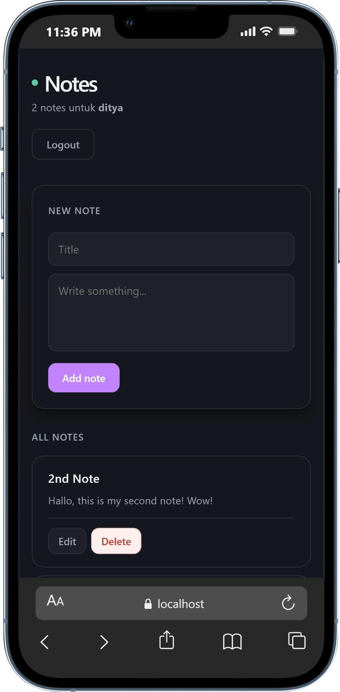

# SimpleNotes

SimpleNotes is a full-stack notes app built with Laravel and React. It uses Laravel session-based authentication and a React UI for login, registration, and personal note management.

## Highlights

- Login, register, and logout with Laravel session auth
- Personal notes tied to the authenticated user
- Create, edit, and delete notes from a React interface
- Faster CRUD flow with local state updates after successful requests

## Stack

- Laravel 13
- PHP 8.3
- React 19
- Vite
- SQLite

## Screenshot

<p align="center">
  
  
</p>


## Quick Start

### 1. Clone and install backend

```bash
git clone <your-repo-url>
cd SimpleNotes
composer install
```

### 2. Create the Laravel env

Windows:

```bash
copy .env.example .env
php artisan key:generate
```

macOS/Linux:

```bash
cp .env.example .env
php artisan key:generate
```

### 3. Prepare SQLite

Windows:

```bash
type nul > database\database.sqlite
php artisan migrate
```

macOS/Linux:

```bash
touch database/database.sqlite
php artisan migrate
```

### 4. Install frontend

```bash
cd frontend
npm install
```

### 5. Create the frontend env

Windows:

```bash
copy .env.example .env
```

macOS/Linux:

```bash
cp .env.example .env
```

Default value:

```env
VITE_API_BASE_URL=http://localhost:8000/api
```

## Run Locally

Backend:

```bash
php artisan serve --host=localhost --port=8000
```

Frontend:

```bash
cd frontend
npm run dev
```

Use:

- Frontend: `http://localhost:5173`
- Backend: `http://localhost:8000`

Do not mix `localhost` and `127.0.0.1`, because that can trigger `419` session/CSRF issues.

## API

Base URL:

```text
http://localhost:8000/api
```

Auth:

- `GET /csrf-token`
- `GET /user`
- `POST /register`
- `POST /login`
- `POST /logout`

Notes:

- `GET /notes`
- `POST /notes`
- `PUT /notes/{id}`
- `DELETE /notes/{id}`

## Notes

- The React app uses `frontend/src/lib/api.js` for request handling
- Notes are updated in local state after create, update, and delete
- Some Blade views still remain for built-in Laravel utility flows like password reset and profile management

## License

This project is open-sourced under the MIT license.
